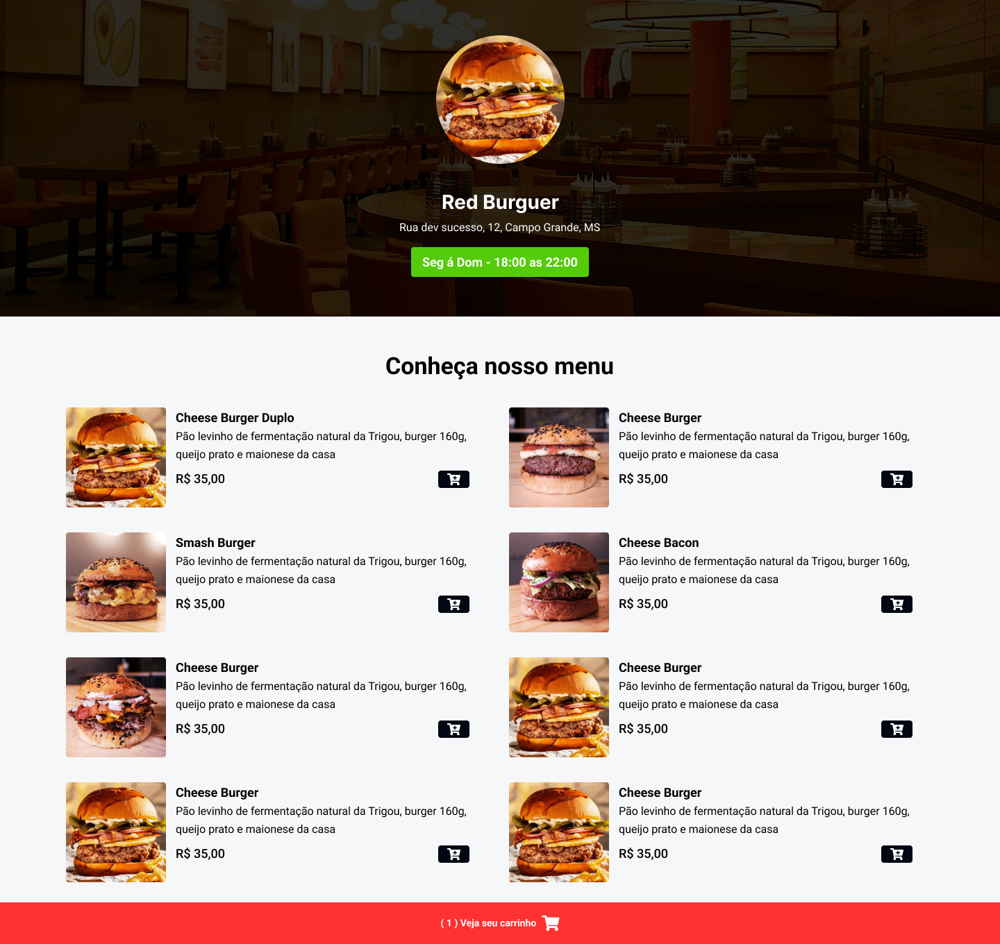

   <h1>Cardápio Online</h1>

   
Projeto completo do zero utilizando HTML, CSS, Tailwind CSS e JavaScript. Com técnicas essenciais de desenvolvimento web, foi criado uma aplicação dinâmica e responsiva deste projeto completo.

   

    

   
   
   
   

   ##

     

   <h3>O que é o <i>Tailwind CSS</i> </h3>

   
<strong>Tailwind CSS</strong> é um <i>framework CSS</i> de código aberto que se destaca por sua abordagem única de design utilitário. Em vez de fornecer estilos pré-estilizados para elementos específicos, ele fornece uma série de classes utilitárias que podem ser diretamente aplicadas aos elementos HTML para estilizá-los. Isso simplifica o processo de criação de estilos para páginas web e aumenta a produtividade.

   
Ele trabalha com classes, que vão somando com cada classe do projeto até formar a página.

   
O <strong>Tailwind CSS</strong> é projetado com uma abordagem <code>“mobile-first”</code>. Isso significa que as classes de utilitário sem prefixo <i>(como uppercase)</i> são aplicadas em todos os tamanhos de tela, enquanto as classes de utilitário com prefixo <i>(como md:uppercase)</i> só são aplicadas no breakpoint especificado e acima. Portanto, você pode facilmente construir interfaces de usuário adaptativas sem nunca sair do seu HTML. Isso é semelhante ao que você pode estar acostumado em outros frameworks como o Bootstrap.

    

   <h3>O que é o <i>package.json</i>?</h3>

   
Quando você executa o comando <code>npm init -y</code> no terminal em seu projeto, o npm (Node Package Manager) cria um arquivo chamado <strong>package.json</strong> no diretório atual do projeto. O <strong>package.json</strong> é um arquivo de metadados para o seu projeto Node.js. Ele contém informações sobre o projeto, como o nome, versão, descrição, dependências, scripts de execução e outras configurações importantes.

   
A opção <code>-y</code> é uma abreviação de <code>--yes</code>, que faz com que o npm aceite automaticamente todas as perguntas feitas durante a inicialização do <strong>package.json</strong>, usando os valores padrão para as respostas. Isso é útil quando você deseja criar rapidamente um <strong>package.json</strong> com as configurações padrão e não precisa revisar ou alterar manualmente cada uma delas.

   
Ao executar <code>npm init -y</code>, o npm cria um <strong>package.json</strong> com valores padrão, incluindo informações mínimas como nome do projeto, versão, descrição e ponto de entrada (geralmente o arquivo principal do seu aplicativo). Você pode então editar este arquivo manualmente ou adicionar mais informações conforme necessário, como dependências, scripts de execução, autor, licença, entre outros detalhes do projeto.

   
Um arquivo <code>.json</code> é um tipo de arquivo de texto usado para armazenar e transmitir dados de forma estruturada. Ele usa uma sintaxe simples de pares chave-valor e é comumente usado na programação para configurar aplicativos, trocar dados entre servidores e clientes web e outras tarefas de gerenciamento de dados.

    

   <h3>O que é o <i>deploy</i>?</h3>

   
Usado principalmente no contexto de desenvolvimento de software e refere-se ao processo de lançar ou disponibilizar uma aplicação ou uma nova versão de um software para uso em um ambiente operacional, como um servidor ou uma plataforma de nuvem. Isso geralmente envolve a transferência dos arquivos e recursos necessários para o ambiente de produção e a configuração adequada para que o software funcione corretamente. O objetivo do deploy é tornar o software acessível e utilizável pelos usuários finais.

   
Em programação, o termo <strong>deploy</strong> está intimamente relacionado à sua tradução literal do inglês: <i>implantar</i>. Em termos práticos, fazer um deploy significa colocar no ar uma aplicação que teve seu desenvolvimento concluído.

   
As etapas de um <strong>deploy</strong> são: 
      
<code>Desenvolvimento</code> — a aplicação fica apenas na máquina do programador, um ambiente de tentativa e erro, onde o profissionais tem a liberdade para criar e trabalhar. Tanto o profissional quanto o código amadurecem para a próxima etapa, 
 
      
<code>Staging/Teste</code> — também chamado de <i>ambiente de homologação</i>. A aplicação passa pelo primeiro deploy para ser disponibilizada a equipe de teste, sendo disponível em uma <i>intranet</i> ou em um ambientes restrito, e a
 
      
<code>Produção</code> — após testes, melhorias e correções, a aplicação é <strong>implantada</strong> no ambiente de produção, agora disponível para os usuários finais. 

   

   
Em resumo, <strong>deploy</strong> é o processo que permite que uma aplicação saia do ambiente de desenvolvimento e seja colocada em uso, garantindo que os usuários possam interagir com ela. Quando você cria um site, um software ou um aplicativo e o torna acessível aos usuários finais, você está realizando um <strong>deploy</strong>.

    

   <h3>O que é o método 'Splice' no <i>JavaScript</i>?</h3>

   
O método <strong>splice()</strong> em JavaScript é um método integrado para manipular arrays. Ele modifica o array original, removendo, substituindo ou adicionando elementos. A sintaxe do método splice() é a seguinte: <code>array.splice(indice, deleteCount, elemento1, ..., elementoN)</code>

   
Os parâmetros são:
      <ul>
         <li><code>indice</code> : O índice no qual deve iniciar a alteração do array. Se for maior que o tamanho total do array, nenhum elemento será alterado. Se for negativo, irá iniciar a partir daquele número de elementos a partir do fim.</li>
          
         <li><code>deleteCount</code> : Um inteiro indicando o número de elementos antigos que devem ser removidos. Se não for especificado, ou se for maior que o número de elementos restantes no array iniciando pelo índice, então todos os elementos até o fim do array serão deletados. Se for 0, nenhum elemento é removido</li>
          
         <li><code>elemento1, ..., elementoN</code> : Os elementos a serem adicionados no array. Se você não especificar nenhum elemento, splice simplesmente removerá elementos do array.</li>
      </ul>
   

   
O valor de retorno é um novo array contendo os elementos deletados. Se nenhum elemento for removido, um array vazio é retornado.

   
Aqui está um exemplo de como usar o método <strong>splice()</strong>:
       
      <code>var myFish = ["angel", "clown", "mandarin", "surgeon"];</code>
      
// remove 0 elementos a partir do índice 2, e insere "drum"

      <code>var removed = myFish.splice(2, 0, "drum");</code>
      
// myFish é ["angel", "clown", "drum", "mandarin", "surgeon"]
          
         
// removed é [], nenhum elemento removido

      

   

    

   <h2>Observações e Anotações para Estudo</h2>

   <ul>
      <li>Quando for realizar um <code>npm init -y</code> no Terminal para criar um <strong>package.json</strong>, o nome do diretório do seu projeto não pode ter mais de uma palavra separada, como <i>Cardápio Online</i>, certifique-se de colocar apenas uma palavra ou, se tiver mais de uma, coloca-lá juntos (senão pode dar um erro ao criar o pacote .JSON).</li>
       
      <li>Dentro do arquivo <strong>tailwind.config.js</strong>, na parte <code>'content'</code>, este caminho escrito que contém HTML e JS, dizendo que os arquivos dentro da nossa pasta que termina com esses dois, podem usar o <i>Tailwind CSS</i>.</li>
       
      <li>Arquivo <strong>package.json</strong>, dentro de <i>scripts</i>, sempre configurar para utilizar o Tailwind CSS: <code>"dev": "npx tailwindcss -i ./styles/style.css -o ./styles/output.css --watch"</code></li>
       
      <li>Sempre que abrir novamente o seu projeto com <strong>Tailwind CSS</strong>, não esqueça de configurar no CMD (Prompt de Comando), o seguinte comando: <code>npm run dev</code> e abrir seu arquivo da página web com o <i>"Open With Live Server"</i>.</li>
       
      <li><code>md, lg, sm: medium | large | small</code> — <strong>Media Query:</strong> um recurso do CSS3 que permite adaptar o layout de uma página web para diferentes tamanhos de tela e tipos de mídia. Ela consiste em um tipo de mídia e uma ou mais expressões que limitam o escopo das folhas de estilo usando características de mídia, como largura, altura e cor. Isso facilita a criação de sites responsivos que se adaptam automaticamente ao dispositivo do usuário</li>
       
      <li>A tag <code>main</code> do HTML define o conteúdo principal dentro do <code><body></code> de um documento ou aplicação. O conteúdo dentro do elemento <code>main</code> deve ser único para o documento e diretamente relacionado ao tópico central da página ou à funcionalidade central da aplicação. Isso significa que seções da página que são comuns a todo o site ou aplicação, como mecanismos de navegação, informações de copyright, logotipo e campos de busca, não devem ser incluídas dentro do elemento <code>main</code>. Além disso, a tag <code>main</code> não pode ser filha dos elementos <code>article</code>, <code>aside</code>, <code>footer</code>, <code>header</code>, ou <code>nav</code>. Você deve usar a tag <code>main</code> do HTML quando precisa de um elemento para inserir o conteúdo principal da página. O conteúdo principal são os textos, imagens, tabelas que estão relacionados com o tema proposto do link em que entramos. Este conteúdo deve ser único na página, ou seja, não deve ser repetido ao longo da página.</li>
       
      <li><strong>Propriedade <code>flex</code> no CSS</strong> — usada em um contêiner flexível para controlar o comportamento de seus itens filhos. Ela é uma abreviação para as propriedades <i>flex-grow</i>, <i>flex-shrink</i> e <i>flex-basis</i>, que controlam como um item cresce, encolhe e é dimensionado inicialmente dentro do contêiner.</li>
       
      <li><strong>Propriedade <code>grid</code> no CSS</strong> — usada para criar um layout de grade bidimensional. Ela é uma abreviação para várias propriedades que definem as linhas e colunas da grade, bem como as áreas da grade. Isso permite um controle preciso sobre o posicionamento e dimensionamento dos elementos na página.</li>
       
      
       
       
      <li><strong>Método <code>addEventListener()</code> no JavaScript:</strong> usado para anexar um manipulador de eventos a um elemento do DOM (Documento de Objeto Modelo). Ele permite que você especifique uma função que será executada quando um evento específico ocorrer no elemento. O <code>addEventListener()</code> escuta os eventos em elementos e executa ações específicas quando esses eventos ocorrem. É uma ferramenta poderosa para interatividade e manipulação de elementos na web.</li>
       
      <li><code>Slice</code> no <strong>JavaScript</strong>: refere-se a um método de array que retorna uma cópia de parte de um array original. Ele não altera o array original, mas cria um novo array contendo os elementos especificados.Um "slice" é uma parte de um array. É como cortar uma fatia de um bolo. Imagine que você tem um bolo (que seria o seu array) e você quer uma parte específica dele, como apenas a parte do meio. O método <code>slice()</code> faz exatamente isso para os arrays.. Ele não altera o array original, mas <strong>cria um novo array</strong> contendo os elementos especificados. O método <code>slice()</code> aceita <strong>dois argumentos opcionais</strong>: o índice inicial e o índice final do intervalo a ser copiado. Se nenhum argumento for fornecido, <code>slice()</code> copiará todos os elementos do array original.</li>
       
      <li><strong>innerHTML, innerText e TextContent no <i>JavaScript</i></strong> : propriedades usadas para manipular o conteúdo de um elemento HTML, mas funcionam de maneiras ligeiramente diferentes. O <code>innerHTML</code> retorna ou define o conteúdo HTML de um elemento. Ele inclui tanto o texto quanto as tags HTML dentro do elemento. Já o <code>innerText</code> retorna ou define apenas o texto “visível” de um elemento. Ele ignora as tags HTML e considera o estilo CSS (como display: none ou visibility: hidden). E o <code>textContent</code> retorna ou define todo o conteúdo de texto de um elemento, incluindo nós de texto em elementos filhos. Ele ignora as tags HTML, mas não considera o estilo CSS.</li>
       
      <li><strong>O que é uma <code>API</code> (Application Programming Interface — Interface de Programação de Aplicação)</strong>: atua como um intermediário que permite a comunicação entre diferentes softwares, facilitando a troca de informações e serviços. Por exemplo, em um aplicativo de viagens, a API permite que o aplicativo envie solicitações para várias companhias aéreas e receba opções de voo em resposta. Isso é possível devido à definição de um "idioma comum" pela API, que permite a troca de dados sem a necessidade de entender internamente o funcionamento de cada sistema. Testes em APIs são essenciais para garantir sua funcionalidade, segurança, desempenho e usabilidade, assegurando assim a entrega de produtos de software robustos e de alta qualidade.</li>
       
      <li><strong>Toastify JS</code> para alertas/notificações</strong> : é uma biblioteca de notificação de <strong>toast</strong> — <i>notificações de computador com uma mensagem leve que aparece na interface do usuário e desaparece automaticamente após um curto período de tempo. Ele é chamado de ‘toast’ porque, assim como uma torrada que salta da torradeira, a notificação aparece e desaparece sem interromper a atividade do usuário. Geralmente, é usado para fornecer feedback rápido sobre uma operação sem exigir uma ação do usuário. Por exemplo, pode informar que uma mensagem foi enviada ou que um arquivo foi salvo</i> — leve com o JavaScript. Aqui estão alguns dos seus recursos: notificações múltiplas e  empilhadas, não bloqueia a thread de execução, opções de personalização incluem texto de notificação, duração, cor de fundo do toast, exibição do ícone de fechamento, posição de exibição e posição de deslocamento.</li>
       
   </ul>

    

   ##

   <h3>Fontes Bibliográficas</h3>

   <ol>
      <li><a href="https://tailwindcss.com/docs/responsive-design"><strong>Responsive Design</strong></a> by <i>Tailwind CSS</i></li>
       
      <li><a href="https://stackoverflow.com/questions/56003852/how-to-change-default-mobile-first-approachtailwind-in-desktop-first"><strong>'Mobile First' to 'Desktop First'</strong></a> by <i>Stack Overflow</i></li>
       
      <li><a href="https://pingback.com/couto/5-motivos-para-comecar-usar-o-tailwindcss"><strong>Motivos para usar o Tailwind CSS</strong></a> by <i>Pingback</i></li>
       
      <li><a href="https://www.brasilcode.com.br/tailwind-css-o-que-e-como-usar/"><strong>O que é Tailwind CSS e como usar</strong></a> by <i>Brasil Code</i></li>
       
      <li><a href="https://programadoresdepre.com.br/guia-completo-para-iniciantes-sobre-tailwind-css/"><strong>Guia completo de Tailwind CSS</strong></a> by <i>Programadores Deprê</i></li>
       
      <li><a href="https://www.freecodecamp.org/portuguese/news/o-que-e-tailwind-css-um-guia-para-iniciantes/"><strong>O que é Tailwind CSS</strong></a> by <i>freeCodeCamp</i></li>
       
      <li><a href="https://www.treinaweb.com.br/blog/o-que-e-tailwind-css-e-como-instalar-via-cdn"><strong>O que é Tailwind CSS e como instalar via CDN</strong></a> by <i>treinaWeb</i></li>
       
      <li><a href="https://www.linkedin.com/posts/joaovitorgomesbastosdossantos_api-garantiadequalidade-testesdesoftware-activity-7180663563517050880-6npp?utm_source=share&utm_medium=member_desktop"><strong>O que é uma API?</strong></a> by <i>João Santos on LinkedIn</i></li>
       
      <li><a href="https://medium.com/@sarahcalande/flexbox-vs-css-grids-ba5d75287dd6"><strong>Flexbox vs. Grid no CSS</strong></a> by <i>Medium</i></li>
   </ol>

   ##

